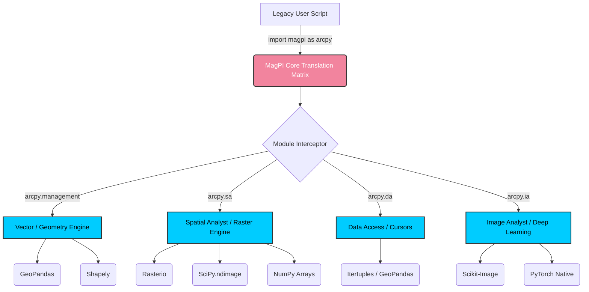

# 🧭 MagPI (Magnetic & Planetary Integrations)
An open-source Python translation matrix designed to liberate geospatial workflows from proprietary dependencies.
## 🌍 The Mission
The modern geospatial industry is heavily reliant on proprietary, closed-source ecosystems (e.g., ESRI's `arcpy`). These systems mandate expensive licenses, lock users into Windows environments, and introduce massive computational bottlenecks by resisting native Linux deployment and vectorized array processing.

MagPI is a Trojan Horse for open-source freedom. It acts as an intercept layer. By simply changing one line of legacy code from `import arcpy` to `import magpi as arcpy`, users can execute their existing geospatial scripts natively on Linux servers. MagPI intercepts the legacy commands and routes them through lightning-fast, open-source libraries like `geopandas`, `rasterio`, and `shapely`.

## 🏗️ Architecture & Routing
MagPI operates by mapping proprietary modules to their open-source C-backed equivalents.


###

## 🚀 Quick Start (Conceptual)
The goal of MagPI is zero-friction adoption for legacy GIS analysts. 

### - Before: `import arcpy`
### - Now: `import magpi as arcpy`
### - Training over for arcpy users.

### Before (Requires a Windows machine and an expensive Spatial Analyst license):
```
import arcpy 
arcpy.analysis.Buffer("roads.shp", "roads_buf.shp", "50 METERS"
```

### After (Executes natively on an Ubuntu server using pure vectorized Python arrays):
```
import magpi as arcpy
arcpy.analysis.Buffer("roads.shp", "roads_buf.shp", "50 METERS")
```
# 🗺️ Project Roadmap & GitHub Projects
The translation of an entire proprietary ecosystem is a massive undertaking. We are tracking progress via GitHub Projects (Kanban). The core modules are currently in the following states of development:
- [x] `arcpy.management` (Vector/Data handling via GeoPandas) - Active
- [x] `arcpy.analysis` (Spatial operations via Shapely) - Active
- [x] `arcpy.sa` (Map Algebra via Rasterio/NumPy) - Active[x] arcpy.da (Data Access / Cursor mapping) - Active[x] arcpy.env (Environment Settings) - Active
- [x] `arcpy.wfs` (Sovereign Data Pulls) - Active

# 🤝 Contributing
MagPI is an initiative of The NexaVision and the Tech Union. We welcome pull requests from data scientists, GIS developers, and open-source advocates who want to help translate specific modules.

Please review our translation philosophy before submitting a PR:
1. Speed: Always prioritize vectorized numpy/pandas operations over row-by-row iteration.
2. Parity: Function signatures (arguments) must match the legacy system exactly to prevent user-side refactoring.
3. Format Freedom: Encourage the conversion of proprietary formats (File Geodatabases) to open standards (GeoPackage, PostGIS).
### Built with intent by Christopher B. Hanni and the Gaian Mind.